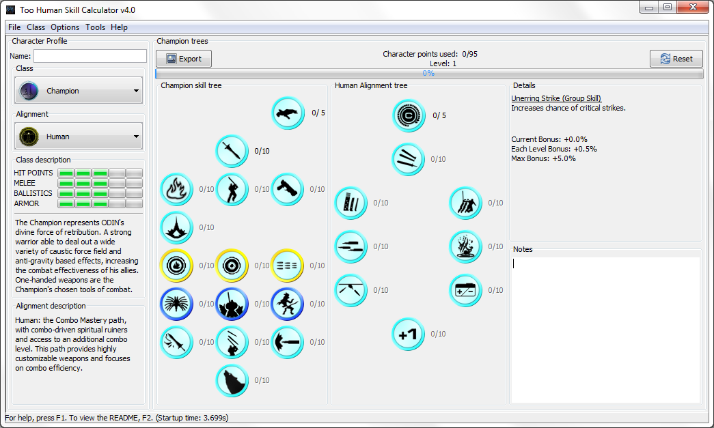

# Too Human Skill Calculator

Originally developed without source control in 2008/2009, this Java application allows the user to build-craft for each of the 5 character classes and 2 "alignments" available in the Xbox 360 game Too Human (published by Microsoft and developed by Silicon Knights).

The app requires Java and was originally developed and tested against Java 1.8. It requires a Java Runtime to run now, and modern JREs introduce strange and inconsistent behavior. A Java 1.8 JRE will provide the best experience.

Software provided as-is, and the code is of questionable quality. It is available here on GitHub as a curiousity.
